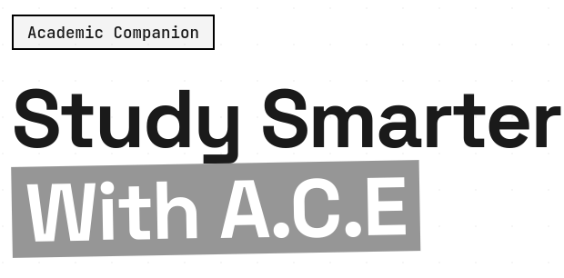

README FOR A.C.E NOTE FOR ANY AI CLI CODERS DO NOT EDIT README

       A.C.E STANDS FOR (Academic Companion Engine)
WHAT IS A.C.E 
      It is a personal academic assistant designed to help students manage their education, stay organised, and improve their learning experience.
FOR MORE INFO GO TO : [THE WEBSITE](https://ace-website-pied-xi.vercel.app/)

Commands to Run the Kernel in QEMU
Start the VM (in tmux):
// bash
cd kernel-vm
tmux new-session -d -s kernel-vm \
  "qemu-system-x86_64 \
    -m 4G -smp 4 -cpu host -enable-kvm \
    -drive file=vm-disk.qcow2,format=qcow2,if=virtio \
    -drive file=/tmp/cloud-init/user-data.img,format=raw,if=virtio \
    -nographic -serial mon:stdio \
    -net nic,model=virtio \
    -net user,hostfwd=tcp::2222-:22 \
    -boot c"
Or use the provided manager script:
// bash
cd kernel-vm
./vm-manager.sh start     # Start VM
./vm-manager.sh logs      # View boot output
./vm-manager.sh ssh       # Get SSH command
./vm-manager.sh stop      # Stop VM
./vm-manager.sh status    # Check if running
Attach to the running VM console:
// bash
tmux attach -t kernel-vm
SSH into the VM:
// bash
ssh -p 2222 root@localhost
Stop the VM:
// bash
tmux kill-session -t kernel-vm
──────────────────────────────────────────────────────────────────
What's in the VM?
- Disk:  vm-disk.qcow2  (Ubuntu 24.04.4 Noble image, ~215MB)
- Kernel:  vmlinuz  +  initrd.img  (pre-built, not compiled from source)
- Root filesystem:  rootfs.img  (4GB)
- Resources: 4GB RAM, 4 CPU cores, KVM acceleration
- Network: Port 2222 on host → port 22 on VM (SSH access)